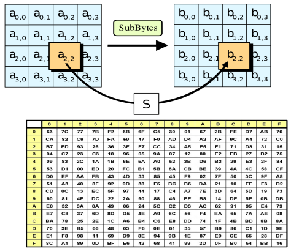
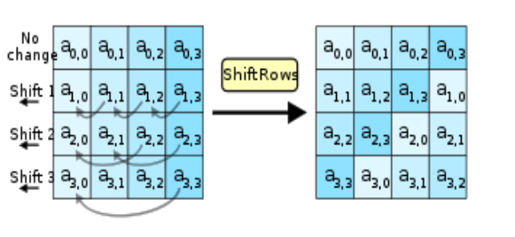
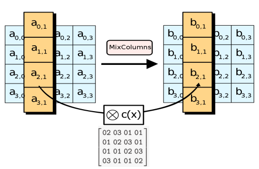
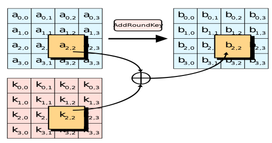
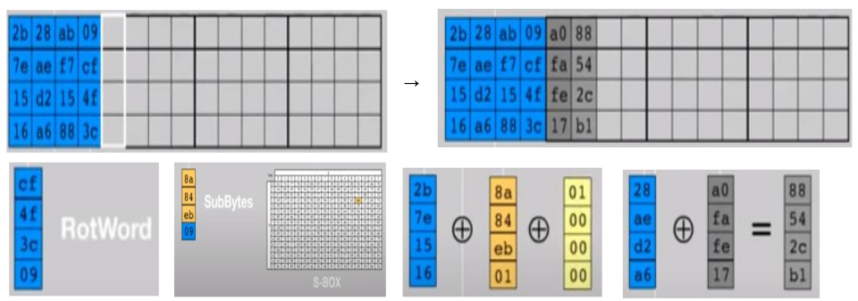

# Advanced Encryption Standard (AES) 

Данный алгоритм реализован на языке Python\
Реализованы **AES-128**, **AES-192**, **AES-256**

Сайт для проверки правильности шифрования [AES Online](https://www.devglan.com/online-tools/aes-encryption-decryption)

## Aлгоритм

Advanced Encryption Standard (AES) — это симметричный алгоритм шифрования, который был принят в качестве стандарта шифрования в США в 2001 году. 
AES заменил устаревший алгоритм DES (Data Encryption Standard) и стал одним из самых широко используемых методов шифрования в мире.

### Описание алгоритма шифрования

Предварительно входные данные разбиваются на блоки по 16 байт, если полный размер не кратен 16 байтам, то данные дополняется до размера, кратного 16 байтам. 
Блоки представляются в виде матрицы 4x4 — state. 
Далее происходит процедура расширения ключа и к каждому блоку state применяются операции 2-4. 
Итак, алгоритм состоит из следующих шагов:
1) Расширение ключа - **KeyExpansion**; 
2) Начальный раунд - сложение **state** с основным ключом; 
3) 9 раундов шифрования, каждый из которых состоит из преобразований:
   - **SubBytes**
   - **ShiftRows**
   - **MixColumns**
   - **AddRoundKey**
4) Финальный раунд, состоящий из преобразований:
   - **SubBytes**
   - **ShiftRows**
   - **AddRoundKey**

Подробнее каждое из представленных выше преобразований:
- **SubBytes** - замена байтов state по таблице S-box. 
Каждый байт представляется в виде двух шестнадцатеричных чисел `b = (x, y)`, где `x` определяется 4 старшими разрядами `b`, а `y` — `4` младшими. 
В таблице `S-box` размера `16x16` находятся значения для замены исходного байта: значение `b'` на пересечении строки `x` и столбца `y` `S-box` используется в качестве замены исходному байту `b`.

- **ShiftRows** — циклический сдвиг строк state. 
Нулевая строка остается на месте, первая смещается влево на 1 байт, вторая на 2 байта и третья на 3 соответственно.

- **MixColumns** — умножения каждого столбца state на фиксированную матрицу. 
Таким образом осуществляется линейное преобразование над столбцами state. 
Причем умножение и сложение производится по правилам, описанным выше.

- **AddRoundKey** — раундовый ключ поэлементно добавляется к state с помощью поразрядного XOR.

- **KeyExpansion** — процедура расширения основного ключа для создания раундовых ключей, которые затем используются в раундах шифрования. 
Расширенный ключ состоит из 44 четырехбайтовых слов (для AES-128) (wi): 4 слова на основной ключ и по 4 слова на 10 раундовых ключей (для AES-128). 
Таким образом, полная длина расширенного ключа составляет 1408 бит (для AES-128).\
Операция расширения ключа использует массив Rcon и состоит из следующих действий:
  - Четыре слова основного ключа переносятся в первые четыре слова расширенного ключа. 
  - Если число i без остатка делится на 4, то `wi = SubBytes(RotByte(wi-1 )) xor Rconi/4`. 
  - Иначе: `wi = wi-4 xor wi-1`.

- Операция **RotByte** производит циклическую перестановку байта исходного слова: `{ x0, x1, x2, x3 } → { x3 , x0 , x1 , x2 }`.

Пример, демонстрирующий генерацию 2 первых слов первого раундового ключа.

### Описание алгоритма дешифрования

Так как все преобразования шифрования выполняются однозначно, то существует обратное преобразование, с помощью которого шифротекст переводится в открытый текст. 
Обратное преобразование представляет собой последовательность инвертированных операций шифрования, выполняемых в обратном порядке:
1) Расширение ключа - KeyExpansion; 
2) 9 раундов дешифрования, каждый из которых состоит из преобразований:
   - AddRoundKey — суммирование state с раундовым ключом;
   - InverseMixColumns — обратная перестановка столбцов state;
   - InverseShiftRows — обратный циклический сдвиг столбцов state;
   - SubBytes — замена байтов state по обратной таблице замен InverseS- box;
3) Финальный раунд:
   - AddRoundKey
   - InverseShiftRows
   - InverseSubBytes

### Другие версии AES

Стандарт допускает только одно значение длины блока state — 128 бит для 3 версий алгоритма AES. 
В то время как размер ключа в разных версиях отличается: 
AES-192 использует 192 — битный размер основного ключа и производит 12 раундов шифрования\
AES-256 — 256 битный размер основного ключа и 14 раундов шифрования.

Большее количество раундов делает шифрование сложнее. 
Таким образом, AES-256 обладает наиболее безопасной реализацией. 
Однако следует заметить, что чем длиннее ключ и больше раундов, тем выше требование к производительности.

В таблице, показанной ниже:
- **Nk** - количество слов в ключе.
- **Nb** - количество слов в блоке.
- **Nr** - количество раундов соответственно.

| Алгоритм     | Nk (количество слов в ключе)  | Nb (количество слов в блоке)  | Nr (количество раундов) |
|--------------|-------------------------------|-------------------------------|-------------------------|
| **AES-128**  | 4                             | 4                             | 10                      |
| **AES-192**  | 6                             | 4                             | 12                      |
| **AES-256**  | 8                             | 4                             | 14                      |

### Безопасность

**AES** считается очень безопасным и эффективным. 
На сегодняшний день не было выявлено серьезных уязвимостей, позволяющих быстро его взломать, что делает его стандартом де-факто для защиты данных.
